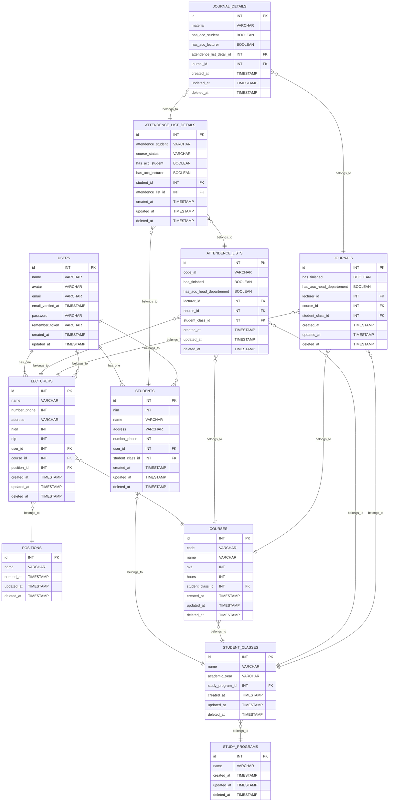
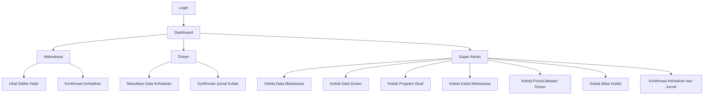

# Sistem Informasi Perkuliahan (SIPerkuliahan)

## Deskripsi Proyek
SIPerkuliahan adalah sistem informasi yang mengelola data perkuliahan termasuk daftar hadir (attendance list) dan jurnal kuliah (journal). Sistem ini memiliki tiga peran utama: mahasiswa, dosen, dan super admin.

## Fitur Utama
- **Manajemen Mahasiswa**
- **Manajemen Dosen**
- **Manajemen Program Studi**
- **Manajemen Kelas Mahasiswa**
- **Manajemen Posisi/Jabatan Dosen**
- **Manajemen Mata Kuliah**
- **Manajemen Daftar Hadir**
- **Manajemen Jurnal Kuliah**

## Teknologi yang Digunakan
- **Laravel**: Framework PHP untuk pengembangan aplikasi web
- **Laravel Breeze**: Untuk otentikasi
- **Laravel Spatie**: Untuk manajemen peran dan izin
- **MySQL**: Basis data relasional
- **Tailwind CSS**: Framework CSS untuk desain antarmuka

## Instalasi
1. Clone repositori:
    ```sh
    git clone https://github.com/Protic-PNC/jkb-sistem-perkuliahan.git
    ```
2. Masuk ke direktori proyek:
    ```sh
    cd jkb-sistem-perkuliahan
    ```
3. Install dependensi:
    ```sh
    composer install
    npm install
    npm run dev
    ```
4. Salin file `.env`:
    ```sh
    cp .env.example .env
    ```
5. Generate key aplikasi:
    ```sh
    php artisan key:generate
    ```
6. Konfigurasi file `.env` sesuai dengan lingkungan pengembangan Anda.
7. Migrasi dan seeder database:
    ```sh
    php artisan migrate --seed
    ```
8. Jalankan server pengembangan:
    ```sh
    php artisan serve
    ```

## Penggunaan
### Peran
- **Mahasiswa**
  - Melihat daftar hadir
  - Mengonfirmasi kehadiran
- **Dosen**
  - Memasukkan data kehadiran mahasiswa
  - Mengonfirmasi jurnal kuliah
- **Super Admin**
  - Mengelola data mahasiswa, dosen, program studi, kelas mahasiswa, posisi, dan mata kuliah
  - Mengirimkan konfirmasi ke head departemen pada daftar hadir dan jurnal

## Login
- Menggunakan Laravel Breeze untuk otentikasi.
- Menggunakan Laravel Spatie untuk manajemen peran dan izin.
- Super admin dibuat menggunakan seeder.

## ERD (Entity Relationship Diagram)
Berikut adalah diagram hubungan antar tabel dalam sistem ini:



## Flowchart

Flowchart di bawah ini memberikan gambaran tentang alur kerja dalam Sistem Informasi Perkuliahan (SIPerkuliahan). Diagram ini menunjukkan bagaimana pengguna dengan peran berbeda (mahasiswa, dosen, dan super admin) berinteraksi dengan sistem dan mengelola data yang relevan.



## Kontribusi

Kami sangat mengapresiasi kontribusi dari komunitas untuk membuat proyek ini lebih baik. Jika Anda ingin berkontribusi, silakan ikuti langkah-langkah berikut:

1. Fork repositori ini.
2. Buat branch fitur baru (`git checkout -b fitur-anda`).
3. Commit perubahan Anda (`git commit -am 'Menambahkan fitur ABC'`).
4. Push ke branch (`git push origin fitur-anda`).
5. Buat Pull Request di GitHub.

Pastikan untuk menulis deskripsi yang jelas tentang perubahan yang Anda lakukan agar kami dapat memahami dan mengevaluasi kontribusi Anda dengan lebih baik. Jangan ragu untuk mendiskusikan ide atau masalah yang Anda hadapi di bagian Issues.

## Lisensi

Proyek ini dilisensikan di bawah MIT License. Untuk informasi lebih lanjut, silakan baca file [LICENSE](LICENSE).

