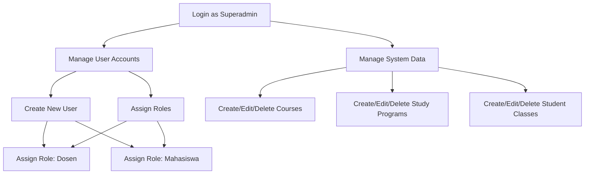
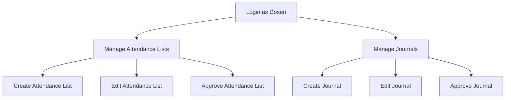
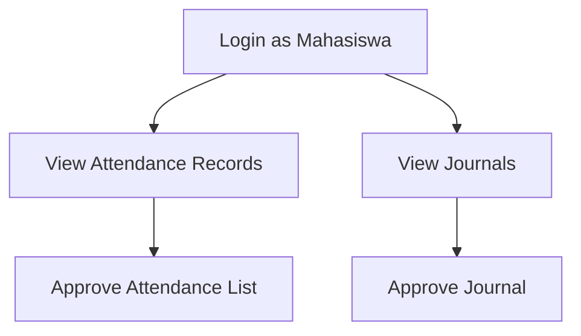

# JKB Lecture Information System

## Overview

JKB Lecture Information System is a comprehensive academic management system designed to streamline the process of managing course attendance, journals, and other academic data for higher education institutions.

## Features

### User Roles

The system supports three distinct user roles:

1. Superadmin
2. Dosen (Lecturer)
3. Mahasiswa (Student)

### Role-specific Functionalities

#### 1. Superadmin

- Can manage all data within the system, except for attendance lists (daftar hadir) and journals
- Responsible for user management, including:
  - Creating new user accounts
  - Assigning roles (Dosen or Mahasiswa) to users

#### 2. Dosen (Lecturer)

- Manage attendance lists (daftar hadir)
- Create and edit journals
- Approve attendance lists and journals

#### 3. Mahasiswa (Student)

- View their own attendance records
- Approve attendance lists and journals

## ERD


## Entities

1. **users**: Stores user account information.
2. **study_programs**: Represents different academic programs offered.
3. **student_classes**: Represents classes or cohorts of students.
4. **positions**: Stores different positions (likely for lecturers).
5. **courses**: Represents academic courses offered.
6. **students**: Stores information about individual students.
7. **lecturers**: Contains data about faculty members.
8. **course_lecturers**: Links courses to their respective lecturers.
9. **lecturer_positions**: Associates lecturers with their positions.
10. **course_classes**: Links courses to specific student classes.
11. **attendance_lists**: Manages attendance records.
12. **attendance_list_details**: Stores detailed attendance information for individual students.
13. **journals**: Likely used for academic or course journals.
14. **journal_details**: Contains specific entries or details for journals.

## Relationships

1. **users - students/lecturers**: One-to-one relationship. Each user account is associated with either a student or a lecturer.

2. **study_programs - student_classes**: One-to-many relationship. A study program can have multiple student classes.

3. **student_classes - students**: One-to-many relationship. Each student class can have multiple students.

4. **courses - course_classes**: One-to-many relationship. A course can be offered to multiple student classes.

5. **lecturers - course_lecturers**: One-to-many relationship. A lecturer can teach multiple courses.

6. **courses - course_lecturers**: One-to-many relationship. A course can be taught by multiple lecturers.

7. **lecturers - lecturer_positions**: One-to-many relationship. A lecturer can hold multiple positions.

8. **attendance_lists - attendance_list_details**: One-to-many relationship. An attendance list contains multiple detailed entries.

9. **students - attendance_list_details**: One-to-many relationship. A student can have multiple attendance records.

10. **lecturers - attendance_lists**: One-to-many relationship. A lecturer manages multiple attendance lists.

11. **course_lecturers - attendance_lists**: One-to-many relationship. Each course-lecturer combination can have multiple attendance lists.

12. **student_classes - attendance_lists**: One-to-many relationship. Each student class can have multiple attendance lists.

13. **journals - journal_details**: One-to-many relationship. A journal contains multiple detailed entries.

14. **attendance_list_details - journal_details**: One-to-one relationship. Each attendance detail can be associated with a journal entry.

## Key Features

- The system supports soft deletes (deleted_at column) for most entities, allowing for data recovery and historical tracking.
- Timestamps (created_at, updated_at) are used across all tables for auditing purposes.
- The structure supports complex relationships between courses, lecturers, and students, allowing for flexible academic management.
- Attendance and journaling systems are tightly integrated with the course and student management aspects of the database.

This database structure provides a robust foundation for managing academic programs, courses, student enrollment, attendance, and related academic activities in a higher education setting.

## Flowchart

### Superadmin Flowhart

### Dosen Flowhart

### Mahasiswa Flowhart


## Installation

1. Clone the repository:
```
git clone https://github.com/Protic-PNC/jkb-sistem-perkuliahan.git
cd jkb-sistem-perkuliahan
```
2. Install dependencies:
```
composer install
npm install
npm run dev
```
3. Set up the environment:

Copy the .env.example file to .env and update the necessary environment variables.
```
cp .env.example .env
php artisan key:generate
```
4. Run database migrations:
```
php artisan migrate
```
5. Seed the database:
```
php artisan db:seed
```
6. Start the development server:
```
php artisan serve
```

## Usage

After completing the installation steps, you can access the application by navigating to http://localhost:8000 in your web browser. Log in with the credentials created during the seeding process.

The application uses Laravel Breeze for authentication. You can log in with the default super admin credentials:

- Email: adisa@admin.com
- Password: 12345678


## Contributing

We welcome contributions to this project! Please follow these steps to contribute:

Fork the repository:

1. Click the "Fork" button at the top right corner of this page to create a copy of this repository under your GitHub account.

2. Clone your forked repository:
```
git clone https://github.com/your-username/jkb-sistem-perkuliahan.git
cd jkb-sistem-perkuliahan
```
3. Create a new branch:
```
git checkout -b feature/your-feature-name
```
4. Make your changes and commit them:
```
git add .
git commit -m "Add a detailed description of your changes"
```
5. Push to your forked repository:
```
git push origin feature/your-feature-name
```
6. Create a pull request:

Open your forked repository on GitHub, select the new branch you created, and click "New pull request." Provide a clear description of your changes.

## Contact
For any questions or concerns, please contact the project maintainers at:

Email: adisalaras41@gmail.com
<br>
GitHub: Protic-PNC
